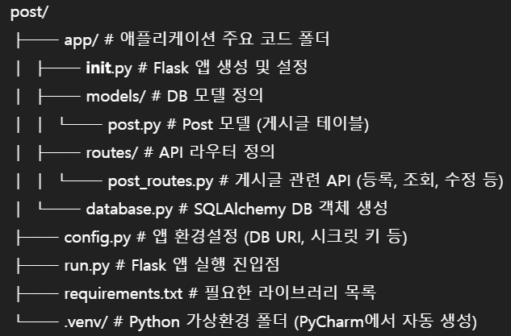

# 📁 프로젝트 구조


# 📌 주요 기능 요약

- 게시글 작성 (POST)
- 게시글 목록 조회 (GET)
- 단일 게시글 상세 조회 (GET)
- 게시글 수정 (PUT)
- 게시글 삭제 (DELETE)
- 조회수 자동 증가 기능
- 게시글 상태(`공개`, `비공개`, `임시`) 관리
---
📦 패키지 설치

```python
pip install -r requirements.txt
```
---
🚀 Flask 서버 실행
```python
python run.py
```

---

```markdown
# Github

git remote, git remote -v 정보 보기 
git fetch <- 깃 저장소에 있는 브랜치들을 다 가져옴
git checkout master <- 마스터로 가겠다.
git pull origin master <- master 정보를 다 가져온다. 
git checkout 원준 <- 원준이가 브랜치 
git merge master <- 충돌이 일어남 

충돌 기본값 
<---- head 


----> 

<--- local


----->

git commit -m "merge: 충돌 해결 "

이제 작업 시작
git status <- 어떤 파일들이 변동사항이 있는가
git add . <- 모든 파일 다올림
git commit -m "feat: 코드 진행사항"
git push origin <브랜치> <- 이러면 이제 깃허브에 올라감 

----
git branch <- 브랜치 목록

git branch 승준짱 
git checkout 승준짱
```
